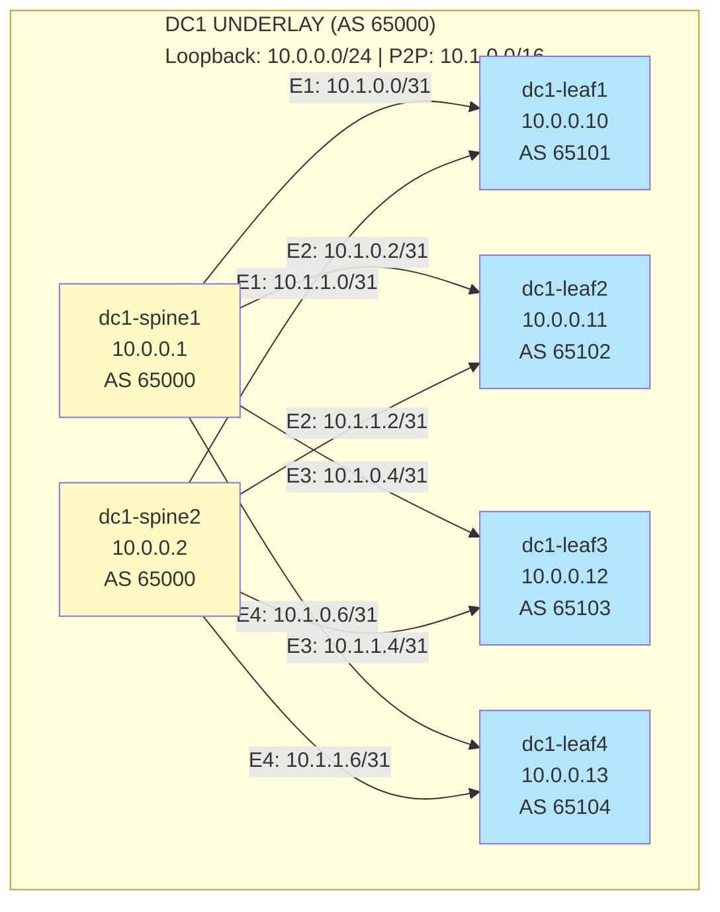
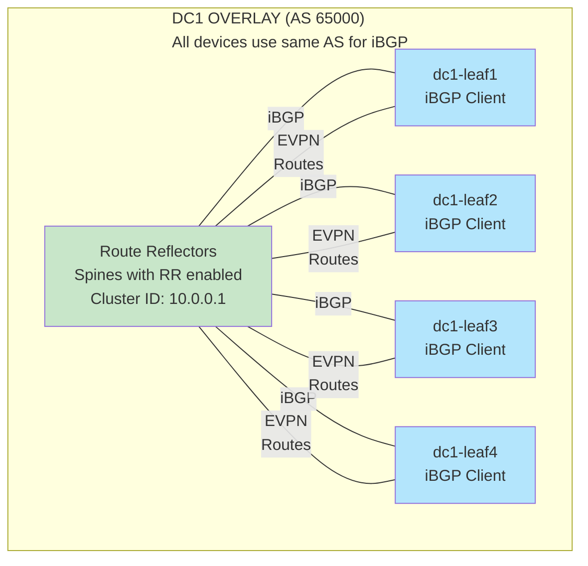
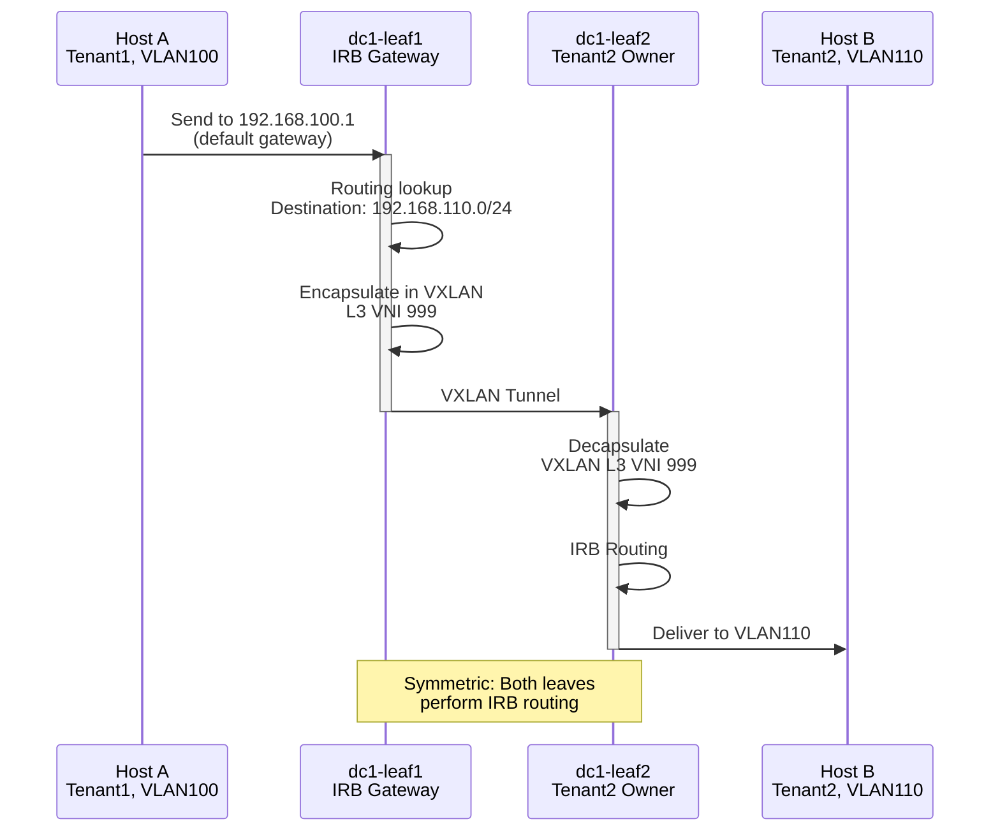
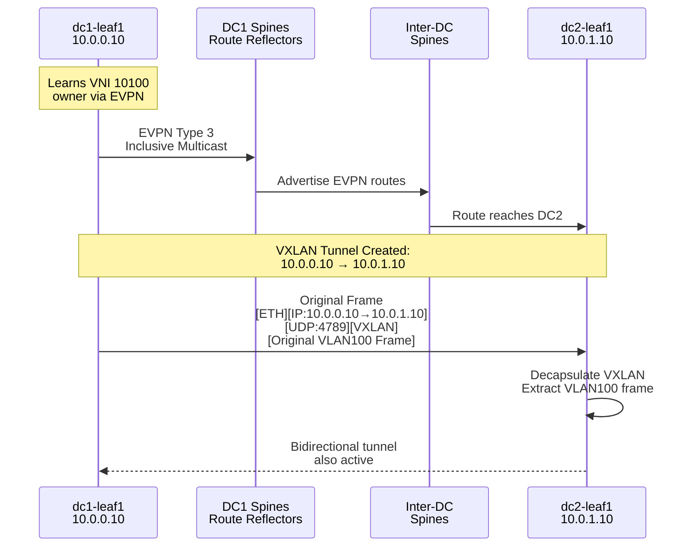
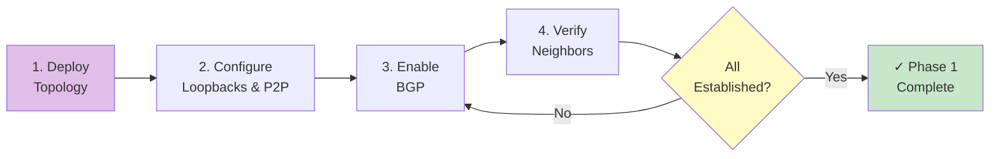
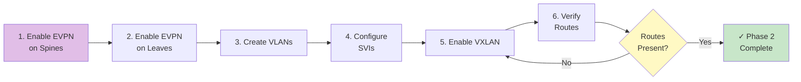
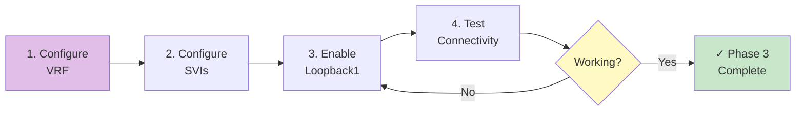
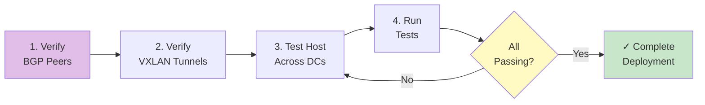

# Multi-DC EVPN Fabric - Design Document

## Overview

Multi-datacenter VXLAN/EVPN fabric with:
- Per-DC autonomous systems (AS 65000 for DC1, AS 65001 for DC2)
- eBGP underlay with BGP unnumbered spine-leaf topology
- EVPN overlay with per-DC RR (route reflector) architecture
- Multi-tenant segmentation (5 tenants × 5 VLANs each)
- Symmetric IRB for inter-tenant routing
- Full infrastructure-as-code with Ansible/AVD
- Containerlab-based testing and validation

---

## Detailed Network Design

### 1. BGP Underlay Architecture

#### Design Goals
- eBGP on all links (no iBGP at leaf layer)
- Easy to scale with new leaves
- Fast convergence on failover

#### Topology


#### BGP Configuration Example (dc1-spine1)

```
router bgp 65000
  bgp log-neighbor-changes
  neighbor 10.1.0.1 remote-as 65101      # dc1-leaf1
  neighbor 10.1.0.3 remote-as 65102      # dc1-leaf2
  neighbor 10.1.0.5 remote-as 65103      # dc1-leaf3
  neighbor 10.1.0.7 remote-as 65104      # dc1-leaf4
  !
  address-family ipv4 unicast
    redistribute connected
    neighbor 10.1.0.1 activate
    neighbor 10.1.0.3 activate
    neighbor 10.1.0.5 activate
    neighbor 10.1.0.7 activate
  exit-address-family
```

#### Inter-DC Peering

DC1 and DC2 spines peer via eBGP for EVPN reachability:

```
DC1-Spine1 (AS 65000) ←→ DC2-Spine1 (AS 65001)  [10.3.0.0/31]
DC1-Spine1 (AS 65000) ←→ DC2-Spine2 (AS 65001)  [10.3.0.2/31]
DC1-Spine2 (AS 65000) ←→ DC2-Spine1 (AS 65001)  [10.3.0.4/31]
DC1-Spine2 (AS 65000) ←→ DC2-Spine2 (AS 65001)  [10.3.0.6/31]
```

This allows DC1 leaves to advertise routes to DC2 leaves and vice versa.

---

### 2. EVPN Overlay Architecture

#### Overlay Goals
- **Isolation:** Per-DC EVPN domains with inter-DC connectivity
- **Scalability:** RR architecture vs full-mesh
- **Multi-tenancy:** VRF per tenant (extensible)

#### Design Pattern: iBGP with Route Reflectors



#### EVPN Route Types Advertised

1. **Type 1 (EAD - Ethernet Auto-Discovery)**
   - Signals leaf is active in VLAN
   - Used for all-active multihoming (future)

2. **Type 2 (MAC/IP)**
   - Carries MAC+IP bindings
   - Enables MAC learning on remote VTEP

3. **Type 3 (Inclusive Multicast)**
   - VXLAN tunnel source
   - Remote VTEP discovery

4. **Type 4 (ES Route)**
   - For MLAG scenarios (not in scope)

5. **Type 5 (IP Prefix)**
   - Inter-tenant routing via symmetric IRB

#### RD/RT Scheme

```
Per-device RD:  ASN:Loopback0
    dc1-leaf1: 65000:10.0.0.10
    dc1-leaf2: 65000:10.0.0.11
    dc2-leaf1: 65001:10.0.1.10
    dc2-leaf2: 65001:10.0.1.11

Per-VLAN RT (export/import):
    For tenant1-vlan100:
        Route Target: 65000:10100
        All leaves in DC1 export/import
        DC2 leaves also import (for multi-DC)

Per-VRF RT (symmetric IRB):
    For default VRF:
        Route Target: 65000:999
        All spines/leaves export/import
```

---

### 3. Multi-Tenancy Design

#### Tenant Isolation

Each tenant has dedicated VLANs and routing context:

```
Tenant1:
  VLAN 100 → VNI 10100 → RT 65000:10100
  VLAN 101 → VNI 10101 → RT 65000:10101
  VLAN 102 → VNI 10102 → RT 65000:10102
  VLAN 103 → VNI 10103 → RT 65000:10103
  VLAN 104 → VNI 10104 → RT 65000:10104
  [Repeat for Tenants 2-5 with different VLAN/VNI ranges]

Traffic isolation:
  - Hosts in Tenant1 VLAN 100 cannot reach Tenant2 VLAN 100 (different RT)
  - Unless explicitly routed via inter-tenant gateway (L3)
```

#### VLAN/VNI Allocation

```
Tenant1: VLANs 100-104, VNIs 10100-10104
Tenant2: VLANs 110-114, VNIs 10110-10114
Tenant3: VLANs 120-124, VNIs 10120-10124
Tenant4: VLANs 130-134, VNIs 10130-10134
Tenant5: VLANs 140-144, VNIs 10140-10144
L3 VRF: VLAN 999, VNI 999 (symmetric IRB)
```

#### Per-Leaf Tenant Membership (Example: dc1-leaf1)

```
SVI Interfaces:
  VLAN 100.1: 192.168.100.1/24   (Tenant1)
  VLAN 101.1: 192.168.101.1/24   (Tenant1)
  VLAN 102.1: 192.168.102.1/24   (Tenant1)
  VLAN 103.1: 192.168.103.1/24   (Tenant1)
  VLAN 104.1: 192.168.104.1/24   (Tenant1)
  VLAN 110.1: 192.168.110.1/24   (Tenant2)
  ... (rest of tenants)

VXLAN Mappings:
  Ingress: 
    Host MAC from VLAN 100 → VNI 10100 encap
  Egress:
    VNI 10100 → VLAN 100 decap → Host
```

---

### 4. Symmetric IRB (Inter-Tenant Routing)

#### Concept

Enables inter-tenant routing (L3) with consistent ingress/egress:



#### Configuration on Leaf

```
vrf definition TENANT_VRF
  rd 65000:999
  route-target export 65000:999
  route-target import 65000:999
  
interface VLAN 100
  vrf forwarding TENANT_VRF
  ip address 192.168.100.1 255.255.255.0
  
interface VLAN 110
  vrf forwarding TENANT_VRF
  ip address 192.168.110.1 255.255.255.0

interface Loopback1
  vrf forwarding TENANT_VRF
  ip address 10.0.0.110 255.255.255.255
  description "Anycast gateway IP for symmetric IRB"
```

---

### 5. VXLAN Tunneling

#### Tunnel Source Selection

```
All VXLAN tunnels source from Loopback0:
  dc1-leaf1: Tunnel source 10.0.0.10
  dc1-leaf2: Tunnel source 10.0.0.11
  dc1-leaf3: Tunnel source 10.0.0.12
  dc1-leaf4: Tunnel source 10.0.0.13
  dc2-leaf1: Tunnel source 10.0.1.10
  ... (etc)

Why Loopback0?
  ✓ Stable, doesn't change with interface flaps
  ✓ Routable via BGP underlay
  ✓ Independent of physical link topology
```

#### VXLAN Tunnel Establishment



#### VNI to VLAN Mapping

```
Configuration on each leaf:
  interface Vxlan1
    vxlan source-interface Loopback0
    vxlan udp-port 4789
    vxlan vlan 100 vni 10100
    vxlan vlan 101 vni 10101
    ... (repeat for all 25 VLANs per DC)
```

---

## Deployment Sequence

### Phase 1: Underlay Establishment


### Phase 2: EVPN Overlay


### Phase 3: Multi-Tenant Configuration


### Phase 4: Inter-DC Connectivity


---

## Scalability & Future Enhancements

### Adding New Leaf
1. Create new host_vars file with unique:
   - Device name
   - Loopback IPs
   - ASN
   - P2P IPs
2. Add to containerlab topology
3. Ansible playbook handles rest

### Adding New Tenant
1. Create new VLAN/VNI ranges in group_vars
2. Configure SVIs per leaf
3. Define new RT values
4. No changes to existing tenants

### Adding New Datacenter
1. Define new fabric AS (65002, 65003, etc.)
2. Create new group_vars/dc{n}*.yml
3. Create new host_vars for all devices
4. Add inter-DC spines peering
5. Ansible handles deployment

### CloudVision Integration (Future)
- Onboard devices to CVP
- Use CloudVision for change approval
- Event-based alerting
- Automated rollback on config failure

### Segment Routing (Future)
- Replace ECMP with segment routing
- Enable Traffic Engineering (TE)
- Implement SR-MPLS or SR-IPv6

---

## Testing Strategy

### Unit Tests (per-device)
```
✓ BGP neighbor state
✓ Interface status
✓ Loopback reachability
✓ EVPN route count
```

### Integration Tests (fabric-level)
```
✓ Host-to-host in same VLAN
✓ Host-to-host in different VLANs (same tenant)
✓ Inter-tenant routing
✓ Multi-DC reachability
✓ Failover scenarios
```

### Stress Tests (future)
```
✓ 1000+ MAC addresses per VLAN
✓ Convergence time after spine failure
✓ Data plane traffic during reconvergence
```

---

## References

- [RFC 7432: BGP MPLS-Based Ethernet VPN (EVPN)](https://tools.ietf.org/html/rfc7432)
- [RFC 8365: A Unified Control Plane for EVPN Data Centers](https://tools.ietf.org/html/rfc8365)
- [Arista EVPN Configuration Guide](https://www.arista.com/)
- [Network Programmability with Arista](https://www.arista.com/)

---

**Document Version:** 1.0  
**Last Updated:** February 2026
