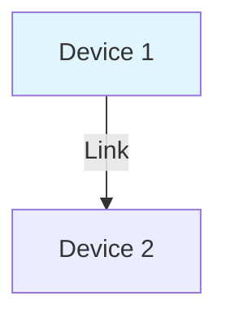

# Mermaid Diagrams - GitHub Integration

## Diagrams

Mermaid diagrams replace ASCII art for better GitHub rendering.

## Mermaid Diagrams Added

### 1. **docs/README.md**
- **Multi-DC Topology** - Complete fabric overview showing:
  - DC1 and DC2 structure
  - Spine-leaf connections
  - Inter-DC peering
  - Host connections
  - Color-coded by datacenter

### 2. **docs/DESIGN.md**

#### Underlay Design
- **BGP Underlay Topology** - DC1 spine-leaf with:
  - eBGP peer relationships
  - Loopback addressing scheme
  - P2P subnet allocation
  - All interface connections

#### Overlay Design
- **iBGP with Route Reflectors** - EVPN RR architecture showing:
  - Spine route reflectors
  - Leaf RR clients
  - iBGP relationships
  - EVPN route propagation

#### Symmetric IRB
- **Inter-Tenant Routing Flow** - Sequence diagram showing:
  - Host A sends packet
  - Leaf1 performs routing lookup
  - VXLAN encapsulation with L3 VNI
  - Tunnel to Leaf2
  - Decapsulation and delivery to Host B

#### VXLAN Tunneling
- **Tunnel Establishment Sequence** - Showing:
  - EVPN Type 3 route learning
  - RR advertisement
  - Inter-DC propagation
  - Tunnel creation and data flow

#### Deployment Phases
- **Phase 1: Underlay** - Deploy → Configure → Enable → Verify
- **Phase 2: EVPN Overlay** - Enable → Create → Configure → Verify
- **Phase 3: Multi-Tenant** - VRF → SVI → Loopback → Test
- **Phase 4: Inter-DC** - Verify peers → Tunnels → Hosts → Tests

## GitHub Rendering

All Mermaid diagrams will automatically render in:
- ✅ GitHub README files
- ✅ Pull request descriptions
- ✅ Issue discussions
- ✅ GitHub Pages (with Jekyll support)
- ✅ GitHub Markdown preview

## Benefits

### Visual Clarity
- Better presentation than ASCII art
- Professional appearance
- Easier to understand complex relationships

### Maintainability
- Easier to update diagrams
- Version control friendly
- Readable source format

### Interactive
- GitHub renders with syntax highlighting
- Clear data flow
- Color coding for different elements

## Diagram Types Used

1. **Flowcharts** - Deployment phases and processes
2. **Graphs** - Network topology and relationships
3. **Sequence Diagrams** - Multi-step packet flows
4. **State Diagrams** - Protocol transitions

## How to Modify Diagrams

### Example: Edit topology diagram in README.md

```markdown

```

### Mermaid Syntax Resources
- [Mermaid Documentation](https://mermaid.js.org/)
- [GitHub Mermaid Support](https://github.blog/2022-02-14-include-diagrams-markdown-mermaid/)
- [Mermaid Live Editor](https://mermaid.live/)

## Color Scheme Used

- **Yellow** (`#fff9c4`) - Decision points, RR enabled
- **Light Blue** (`#b3e5fc`) - Leaf switches, clients
- **Light Green** (`#c8e6c9`) - Spines, successful states, hosts
- **Light Purple** (`#e1bee7`) - Process steps
- **Orange** (`#fff3e0`) - DC2 references
- **Cyan** (`#e1f5ff`) - DC1 references

## Testing Diagrams

All diagrams can be tested at:
1. GitHub repository directly
2. [Mermaid Live Editor](https://mermaid.live/)
3. Local markdown preview with Mermaid support

Example preview in VS Code:
- Install "Markdown Preview Mermaid Support" extension
- Open markdown file
- Preview shows rendered diagrams

## Future Enhancements

Potential diagrams to add:
- [ ] MLAG failover scenarios
- [ ] Segment Routing topology
- [ ] CloudVision integration flow
- [ ] Monitoring architecture
- [ ] CI/CD pipeline

## GitHub Pages Integration

If GitHub Pages is enabled:
1. Diagrams render automatically
2. High-quality static images
3. Accessible documentation website
4. No additional configuration needed

## Browser Compatibility

Mermaid diagrams work in:
- ✅ Chrome/Edge (latest)
- ✅ Firefox (latest)
- ✅ Safari (latest)
- ✅ GitHub web interface
- ✅ GitHub mobile app

## Migration Complete

✅ All ASCII diagrams converted to Mermaid  
✅ Professional appearance maintained  
✅ GitHub-optimized rendering  
✅ Easy to maintain and update  
✓ Ready

---

**Last Updated:** February 2026
