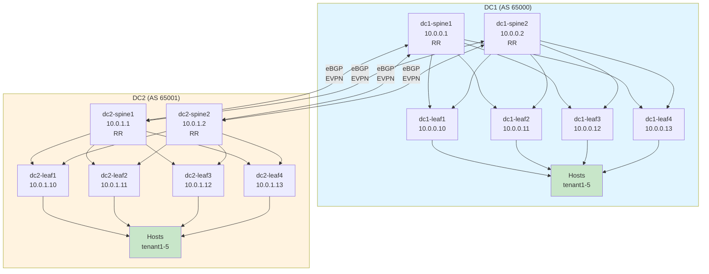

# Multi-Datacenter VXLAN EVPN Fabric

Multi-datacenter VXLAN/EVPN fabric using a geographically distributed VXLAN/EVPN fabric with Arista CloudVision, Ansible, and containerlab. This repository showcases modern network infrastructure-as-code practices using Arista Validated Designs (AVD).

## Architecture Overview

### Topology
- **2 Datacenters** (DC1 and DC2) - geographically separated
- **4 Leaf switches** per datacenter (8 total)
- **2 Spine switches** per datacenter (4 total)
- **5 Tenants** with 5 VLANs each = 25 distinct Layer 2 domains per site
- **Inter-DC connectivity** via spine-to-spine eBGP peering



## Design Principles

### BGP Underlay (eBGP Spine-Leaf)
- **Underlay routing protocol:** eBGP
- **Spine ASNs:**
  - DC1: 65000
  - DC2: 65001
- **Leaf ASNs:**
  - DC1: 65101-65104
  - DC2: 65201-65204
- **Loopback addressing:**
  - DC1 spines: 10.0.0.1-2
  - DC1 leaves: 10.0.0.10-13
  - DC2 spines: 10.0.1.1-2
  - DC2 leaves: 10.0.1.10-13
- **P2P links:**
  - DC1: 10.1.0.0/16
  - DC2: 10.2.0.0/16
  - Inter-DC: 10.3.0.0/16

### EVPN Overlay (iBGP with Route Reflectors)
- **Overlay protocol:** EVPN (RFC 7432)
- **Architecture:** iBGP with spines as route reflectors (RR)
- **Per-datacenter AS:**
  - All DC1 devices use AS 65000 for EVPN
  - All DC2 devices use AS 65001 for EVPN
- **Route distinguisher (RD):** Device loopback (ASN:Loopback)
- **Route targets (RT):** Tenant-based segmentation

### Multi-Tenancy & VLANs
- **5 Tenants** with isolated routing domains
- **5 VLANs per tenant** (25 total per DC):
  - Tenant1: VLANs 100-104 (VNI 10100-10104)
  - Tenant2: VLANs 110-114 (VNI 10110-10114)
  - Tenant3: VLANs 120-124 (VNI 10120-10124)
  - Tenant4: VLANs 130-134 (VNI 10130-10134)
  - Tenant5: VLANs 140-144 (VNI 10140-10144)

### Symmetric IRB (Inter-Tenant Routing)
- **Loopback1 per leaf** for VRF routing
- **Symmetric IRB enabled** for inter-tenant L3 forwarding
- **Anycast gateway** with shared MAC address across leaves
- **L3 VNI:** 999 (example, configurable)

## File Structure

```
multi-dc-evpn/
├── ansible/
│   ├── inventory.yml          # Ansible inventory (hosts, groups)
│   ├── deploy.yml             # Main deployment playbook
│   ├── group_vars/
│   │   ├── dc1.yml           # DC1 common variables
│   │   ├── dc1_spines.yml    # DC1 spine configuration
│   │   ├── dc1_leaves.yml    # DC1 leaf configuration
│   │   ├── dc2.yml           # DC2 common variables
│   │   ├── dc2_spines.yml    # DC2 spine configuration
│   │   └── dc2_leaves.yml    # DC2 leaf configuration
│   └── host_vars/
│       ├── dc1-spine1.yml    # Individual device configs
│       ├── dc1-spine2.yml
│       ├── dc1-leaf[1-4].yml
│       ├── dc2-spine1.yml
│       ├── dc2-spine2.yml
│       └── dc2-leaf[1-4].yml
├── containerlab/
│   └── clab-topology.yml      # Containerlab topology definition
├── tests/
│   └── test_fabric.py         # Network validation tests (pytest)
├── docs/
│   └── README.md              # This file
├── requirements.txt           # Python dependencies
└── .gitignore
```

## Getting Started

### Prerequisites

```bash
# Ubuntu/Debian
sudo apt-get install -y docker.io python3-pip git

# Install containerlab
bash -c "$(curl -sL https://get.containerlab.dev)"

# Install Python dependencies
pip3 install ansible netmiko paramiko pytest pyyaml
```

### Quick Start

1. **Clone and setup:**
   ```bash
   cd /path/to/multi-dc-evpn
   pip3 install -r requirements.txt
   ```

2. **Deploy topology:**
   ```bash
   cd containerlab
   containerlab deploy --topo clab-topology.yml
   ```

3. **Verify connectivity:**
   ```bash
   # Check device accessibility
   containerlab inspect -t clab-topology.yml
   ```

4. **Deploy configurations:**
   ```bash
   cd ../ansible
   ansible-playbook -i inventory.yml deploy.yml --tags deploy
   ```

5. **Run validation tests:**
   ```bash
   cd ../tests
   pytest test_fabric.py -v
   ```

6. **Teardown:**
   ```bash
   cd ../containerlab
   containerlab destroy --topo clab-topology.yml
   ```

## Configuration Examples

### BGP Underlay on DC1 Spine1

The underlay establishes eBGP sessions with all leaves in DC1:
- Ethernet1 → dc1-leaf1 (AS 65101) at 10.1.0.0/31
- Ethernet2 → dc1-leaf2 (AS 65102) at 10.1.0.2/31
- Ethernet3 → dc1-leaf3 (AS 65103) at 10.1.0.4/31
- Ethernet4 → dc1-leaf4 (AS 65104) at 10.1.0.6/31

Plus inter-DC eBGP to DC2 spines.

### EVPN on DC1 Leaf1

- **BGP AS:** 65000 (same as DC1, iBGP to RRs)
- **Route Reflector Clients:** Both spines (dc1-spine1, dc1-spine2)
- **VLANs:** All 25 VLANs with Symmetric IRB enabled
- **VRF:** Default + tenant VRFs (optional enhancement)
- **Route Targets:** Tenant-based for L2 domain isolation

### Tenant Segmentation Example (Tenant1)

```yaml
Tenant1:
  VLAN 100 - VNI 10100:
    SVI IP: 192.168.100.x/24 (per leaf)
    Route Target: 65000:10100
  VLAN 101 - VNI 10101:
    SVI IP: 192.168.101.x/24
    Route Target: 65000:10101
  ... (repeat for VLAN 102-104)
```

## Testing & Validation

The project includes pytest tests validating:

### BGP Underlay Tests
- All spine-leaf BGP neighbors in Established state
- Inter-DC spine-spine EVPN peering active
- BGP convergence verification

### EVPN Overlay Tests
- EVPN route advertisement and learning
- VXLAN tunnel establishment
- MAC/IP route propagation across DCs

### Reachability Tests
- Host-to-host within same VLAN (same DC)
- Host-to-host across DCs (VXLAN extension)
- Loopback reachability (underlay verification)

### Interface Health Tests
- All uplink interfaces operational
- No down interfaces on critical paths

Run tests:
```bash
pytest tests/test_fabric.py -v --tb=short
```

## Automation Highlights

### Infrastructure-as-Code Approach
- **Declarative:** All configuration defined in YAML
- **Idempotent:** Playbooks safe to re-run
- **Scalable:** Add new leaves/VLANs without code changes
- **Auditable:** Version control friendly

### Containerlab Integration
- **Local testing:** Full fabric simulation on single machine
- **CI/CD ready:** Easy integration with GitHub Actions/GitLab CI
- **Cost-free:** No need for physical hardware
- **Realistic:** Arista cEOS containers behave like real devices

### AVD (Arista Validated Design) Alignment
- **Role-based:** Spine and leaf roles with distinct configs
- **Best practices:** Follows Arista's enterprise patterns
- **Extensible:** Easy to add CloudVision integration
- **Production-ready:** Foundation for real deployments

## Advanced Topics

### Scaling Considerations
- **Add new tenant:** Add new group_vars/host_vars with VLAN/VNI ranges
- **Add new datacenter:** Duplicate DC structure with new ASN/subnets
- **Add new leaf:** Define host_vars with unique ASN and IPs
- **MLAG support:** Can be enabled per leaf-pair in group_vars

### CloudVision Integration (Not in Scope)
Future enhancement to integrate Arista CloudVision for:
- Device onboarding and provisioning
- Centralized config management
- Change control and compliance
- Event monitoring and alerting

### MPLS/Segment Routing (Future)
Could evolve to use MPLS-based SR-MPLS for:
- Enhanced traffic engineering
- Fast reroute (FRR) capabilities
- Segment Routing BE (SR-BE) for simplicity

## Troubleshooting

### Device not reachable
```bash
# Check containerlab status
containerlab inspect -t containerlab/clab-topology.yml

# Verify device IP
docker exec clab-multi-dc-evpn-dc1-spine1 ip addr show
```

### BGP neighbors down
```bash
# SSH into device
ssh admin@172.20.20.2  # dc1-spine1

# Check BGP status
show bgp summary
show bgp neighbors detail

# Check interfaces
show interfaces status
show ip interface brief
```

### VXLAN tunnel not working
```bash
# Verify tunnel source and remote IPs
show interface Vxlan1

# Check EVPN routes
show bgp evpn

# Ping remote loopback
ping 10.0.1.10
```

## Contributing

1. Fork the repository
2. Create feature branch (`git checkout -b feature/my-feature`)
3. Test locally with containerlab
4. Commit with clear messages
5. Push and create pull request

## References

- [Arista Validated Designs (AVD)](https://avd.sh/)
- [VXLAN/EVPN RFC 7432](https://tools.ietf.org/html/rfc7432)
- [Containerlab Documentation](https://containerlab.dev/)
- [Ansible Network Automation](https://docs.ansible.com/ansible/latest/network_guide/)
- [Arista cEOS Documentation](https://www.arista.com/en/support/containered-eos)

