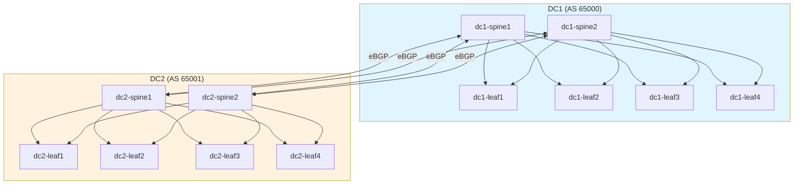

# Multi-DC EVPN Fabric

Multi-datacenter VXLAN/EVPN fabric — Arista AVD and Containerlab.

**2 DCs** | eBGP underlay | EVPN overlay (spines as RRs) | Redundant spine-to-spine DCI | Symmetric IRB

| | DC1 | DC2 |
|---|---|---|
| **Spines** | 2 (AS 65000) | 2 (AS 65001) |
| **Leaves** | 4 (AS 65101–65104) | 4 (AS 65201–65204) |
| **Hosts** | 4 | 4 |
| **Tenants** | 5 (VLANs 100–144) | 5 (VLANs 100–144) |


```mermaid
graph TB
    subgraph DC1["DC1 (AS 65000)"]
        DC1_S1["dc1-spine1"]
        DC1_S2["dc1-spine2"]
        DC1_L1["dc1-leaf1"]
        DC1_L2["dc1-leaf2"]
        DC1_L3["dc1-leaf3"]
        DC1_L4["dc1-leaf4"]
        DC1_S1 --> DC1_L1
        DC1_S1 --> DC1_L2
        DC1_S1 --> DC1_L3
        DC1_S1 --> DC1_L4
        DC1_S2 --> DC1_L1
        DC1_S2 --> DC1_L2
        DC1_S2 --> DC1_L3
        DC1_S2 --> DC1_L4
    end
    subgraph DC2["DC2 (AS 65001)"]
        DC2_S1["dc2-spine1"]
        DC2_S2["dc2-spine2"]
        DC2_L1["dc2-leaf1"]
        DC2_L2["dc2-leaf2"]
        DC2_L3["dc2-leaf3"]
        DC2_L4["dc2-leaf4"]
        DC2_S1 --> DC2_L1
        DC2_S1 --> DC2_L2
        DC2_S1 --> DC2_L3
        DC2_S1 --> DC2_L4
        DC2_S2 --> DC2_L1
        DC2_S2 --> DC2_L2
        DC2_S2 --> DC2_L3
        DC2_S2 --> DC2_L4
    end
    DC1_S1 <-->|eBGP| DC2_S1
    DC1_S1 <-->|eBGP| DC2_S2
    DC1_S2 <-->|eBGP| DC2_S1
    DC1_S2 <-->|eBGP| DC2_S2
    style DC1 fill:#e1f5ff
    style DC2 fill:#fff3e0
```

## Quick Start

**Prerequisites:** Docker, [Containerlab](https://containerlab.dev), Python 3

```bash
pip3 install -r requirements.txt

# Deploy (interactive)
./deploy.sh

# — or manually —
cd containerlab && sudo clab deploy -t clab-topology.yml
cd ../ansible  && ansible-playbook -i inventory.yml deploy.yml
cd ../tests    && pytest test_fabric.py -v

# Topology visualizer: http://localhost:8080/graphite/

# Teardown
cd containerlab && sudo clab destroy -t clab-topology.yml
```

## Project Layout

```
ansible/
  inventory.yml, deploy.yml, group_vars/, host_vars/
containerlab/
  clab-topology.yml          # cEOS + Graphite visualizer
tests/
  test_fabric.py             # Pytest validation
deploy.sh                    # Interactive deploy/destroy
requirements.txt
```

## Docs

- [DESIGN.md](DESIGN.md) — Network architecture, BGP, EVPN, VXLAN, multi-tenancy
- [TROUBLESHOOTING.md](TROUBLESHOOTING.md) — Common issues and fixes
- [QUICK_REFERENCE.md](../QUICK_REFERENCE.md) — Device IPs, credentials, VLAN/VNI table, commands
- [CONTRIBUTING.md](../CONTRIBUTING.md) — Dev workflow and coding standards

## cEOS Image

This lab runs on Arista cEOS (containerized EOS). cEOS is free but requires an Arista account to download:

1. Create an account at [arista.com](https://www.arista.com/en/user-registration)
2. Go to **Software Downloads → cEOS-lab**
3. Download the latest `.tar.xz` image
4. Import it:
   ```bash
   docker import cEOS64-lab-<version>.tar.xz ceos64:latest
   ```

**References:** [Arista AVD](https://avd.sh/) · [Containerlab](https://containerlab.dev/) · [RFC 8365 — VXLAN/EVPN](https://tools.ietf.org/html/rfc8365) · [RFC 7432 — EVPN](https://tools.ietf.org/html/rfc7432)

